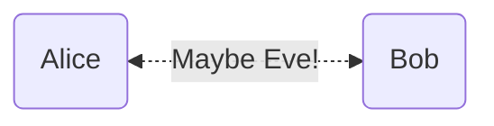

# Topic-Authentication
A protocol for **authentication** is one that allows a party to verify the identity of another party. Authentication protocols aim to prevent an [adversary](https://wiki.uncloak.com/Adversary, Security Model) from false impersonation and modifying communication.

[asymmetric](https://wiki.uncloak.com/Message Authentication Codes (MAC)|Message Authentication Codes (MAC)]] are a family of algorithms of [Symmetric Encryption|symmetric]] primitives for message authentication, for parties who share key information. Parties who do not share key information may instead use [Signatures|signatures](https://wiki.uncloak.com/Symmetric Encryption|symmetric](https://wiki.uncloak.com/Signatures|signatures](https://wiki.uncloak.com/Symmetric Encryption|symmetric) primitives for message authentication, for parties who share key information. Parties who do not share key information may instead use [[Topic-Signatures|signatures), which are closely related to [[Topic-Asymmetric Encryption, Public Key Encryption) encryption.

## Alice and Bob authenticate one another
[Alice](https://wiki.uncloak.com/Alice and Bob) wants to send a message to Bob, but Eve may have interfered with the message en-route, or Eve may even just be pretending to be Alice. Bob needs a way to believe that Alice really sent the message: that Eve did not interfere.

If Alice and Bob share a secret key, Alice may take the hash $h$ of her message $m$, and their shared key $k$. Because Eve does not have access to the key, she would not be able to compute this hash, but Bob would be able to:
$$
\begin{align}
\text{Alice computes}:&\ \underbrace{a}_{MAC} := h(k,m)  \\
\text{Alice sends}:&\ (m,a) \\
\text{Bob verifies}:&\ a =_{?} h(k,m)
\end{align}
$$

This authentication technique can be layered with an encryption scheme, to allow Alice to perform [authenticated encryption](https://wiki.uncloak.com/Authenticated Encryption):
$$
\begin{align}

\text{Alice computes}:&\ c:= E(k_E, m),\quad  \\
&\ a := h(k,c)  \\
\text{Alice sends}:&\ (c,a) \\
\text{Bob verifies}:&\ a =_{?} h(k,c) \\
\text{Bob computes}:&\ m = D( k_D, c)
\end{align}
$$

If instead, Alice would like to authenticate herself to another party with whom she does not share secret information, she can instead use a digital [signature]], derived from her private key. Signatures are particularly useful if Alice would like to broadcast her authentication, without having to interact with each receiving party, or publish a signature that may be verified at a later time by any another party. There are several schemes for constructing digital signatures, but the most well known of these are [Digital Signature Algorithm (ECDSA)]], [Schnorr Signatures (EdDSA)](https://wiki.uncloak.com/Digital Signature Algorithm (ECDSA)](https://wiki.uncloak.com/Schnorr Signatures (EdDSA)](https://wiki.uncloak.com/Digital Signature Algorithm (ECDSA)), [[Algorithm-Schnorr Signatures (EdDSA)), and [[Algorithm-RSA Signatures](https://wiki.uncloak.com/Signatures).

Todo: [Man In The Middle (MITM)](https://wiki.uncloak.com/Man In The Middle (MITM))

## Recommended Paths through this topic

## Applications

## History

---
## Related Pages
- primary-topic:: [Cryptography](https://wiki.uncloak.com/Cryptography)

## External Resources
- Wikipedia:: [Authentication](https://en.wikipedia.org/wiki/Authentication)

## References
*This section is for citations of any claims made in the page*.